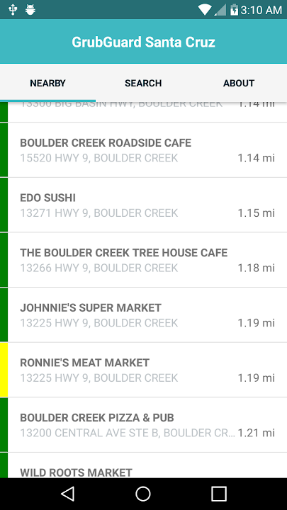

# GrubGuard Santa Cruz

GrubGuard was an application for iOS and Android that displayed information
about food safety inspections for restaurants and facilities in the
county of Santa Cruz (California.)

Users can search for facilities by name, or get a list of facilities sorted
by distance from the user if they choose to share their location permissions
with the app.

It was previously available on Google Play and the Apple App Store.

This is the mobile application frontend.
Server code can be found in [this repo.](https://github.com/pdlandis/grubguard-santa-cruz-server)

## Development Details
The GrubGuard frontend (this repo) was written in TypeScript, HTML and CSS.
The app was created using [NativeScript](https://nativescript.org/), 
a framework for developing cross-platform mobile applications (similar to
Xamarin or React Native.)

The [GrubGuard server](https://github.com/pdlandis/grubguard-santa-cruz-server)
was created using Node.js (Express.)
It uses a MongoDB backend (with Mongoose ODM.)

The GrubGuard mobile application requires a connection to the GrubGuard
server to operate correctly.

Queries to the GrubGuard server are performed via an REST API. The application
queries the server for a list of facilities when searching, and sends a
new request for additional information when a detail page is opened. Detail
information is cached in-memory on the device to avoid repeatedly hitting the
API server when the user is just going back and forth between search results
and previously viewed detail pages.
